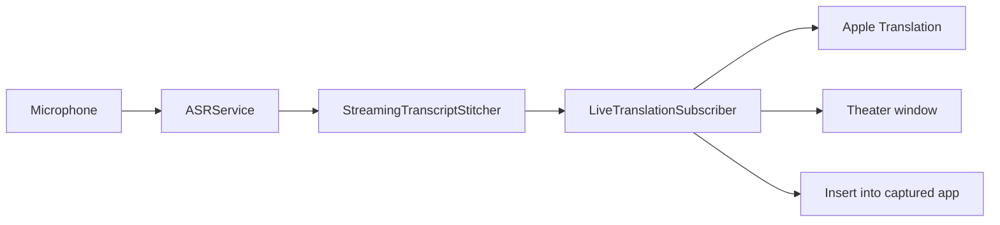

# Architecture

connectingCaptions keeps FluidVoice for the Voice Engines only. Theater owns Listen, the partial bus, History, and the app identity. See [CREDITS.md](../CREDITS.md). This document is the map of **this product**: Theater captions and dictation insert. Voice Engine is Apple Speech. Translation Engine is Apple Translation. I speak and Show as are every language both can use. Translate follows I speak into Show as.

## What to work on

| Area | Path | Role |
| --- | --- | --- |
| Live translation | `Sources/ConnectingCaptions/Services/LiveTranslation/` | Clause split, Apple Translation, on-screen Theater captions, the Pop-up task bar, Speak captions, this-talk notes, pace cue, latency HUD, optional MLX. `LiveTranslationSubscriber` owns the session; `LiveTranslationCommitContext` and `LiveTranslationMT` are the commit / translate helpers; `TheaterInbox` is the task bar; `TheaterSpokenDelivery` speaks published Show-as lines; `TheaterStatus` is the status channel. |
| Theater UI | `Sources/ConnectingCaptions/UI/LiveTranslation/` | Home, Theater window, presenter chrome |
| Speech engine | `ASRService.swift` plus `ASRService+*.swift` | Microphone → transcript. Reads `SpeechCapturePolicy`. Keep this as the engine, not the product. Theater pause-only ticks call `PauseIntervalAudio` from the streaming and Stop paths. |
| Theater Listen | `ContentView+TheaterListen.swift`, `TheaterSpeechSession.swift` | Caption and insert start/stop. `prepareListen` pins I speak once, then `asr.start`. Never `ActiveRecordingMode.dictate`. |
| Dictation insert | `TypingService`, `GlobalHotkeyManager`, `QuickTranslateInsert` | Listen, then type uses the app captured at start and shows that line on a bar. Type the board uses the frontmost field. Caption Listen is `HotkeyHoldModeType.captionListen`. |
| Overlay | `BottomOverlayView`, `NotchOverlayManager` | Hidden during Theater Listen. Listen, then type uses `QuickTranslateInsert`, not this notch. |
| Settings | `SettingsStore.swift` plus `SettingsStore+*.swift` | Persist models, shortcuts, Theater options. Sidebar and Settings search use `SettingsSection.productSections` (no Dictation, no Experimental). |
| App shell | `ContentView.swift` plus `ContentView+*.swift` | Window, Theater Listen, onboarding |

New settings belong in a `SettingsStore+*.swift` file, not in the core store. New ContentView routing belongs in `ContentView+*.swift`.

## Live path

1. Theater Listen, Voice, Translate, and I speak / Show as run on macOS 15 and later. Apple Speech Analyzer stays macOS 26+. `TheaterSpeechSession` installs the capture policy and sinks `$partialTranscription` into `LiveTranslationController.handlePartial`. `MenuBarManager` does not forward Theater partials. `ASRService` produces partial and final transcripts from the selected Voice Engine. Theater Listen keeps the custom dictionary and leaves spoken words such as "period" and "um" alone. It does not pause the presenter's media, play a start or stop chime, or switch Parakeet to Faster Long Dictation's incremental window. **I speak** owns the Voice Engine listening language; leftover Whisper / Apple Speech / Cohere / Nemotron locales are pinned to that language and ASR reloads so Translate cannot start on a stale locale. Translate is I speak → Show as. **Either way** is a Home and Theater chrome toggle (`theaterDynamicPairing`). When Whisper can hear both languages of the pair, a clause spoken in Show as flips; script-distinct pairs such as English ↔ Korean flip from Hangul/Latin without waiting on Whisper. Apple Speech and Parakeet stay on I speak, so the control stays visible but disabled with that reason. **Voice Engine** is Apple Speech Analyzer when this Mac has it, otherwise Apple Speech. **Translation Engine** is on-device Apple Translation. Setup lists Voice Engine and Language packs. **Voice** writes that transcript. **Translate** captions into Show as for every language both Apple Translation and a Voice Engine can use. Both use the microphone. A button on Home and Theater chrome switches the two. Hosted CI cannot prove a live Theater listen.
2. `LiveTranslationController` owns a caption or insert session. Critical thermal can swap this Listen to Apple Speech without writing the Voice Engine setting; the user engine returns on Stop.
3. `TheaterBoardAdmission` is the only gate that decides whether a finished sentence may become a row, and `LiveTranslationSubscriber.publish` is the only writer of the caption log and `TheaterBoardState`. `LiveTranslationSubscriber` accepts a finished sentence once speech continues past its ending. A sentence that is still the whole draft waits until that wording stops changing, then prints. It does not wait for the next sentence. A revision replaces the held wording so only the finished version prints. One tick is not enough, so a provisional period does not paint. Each finished sentence starts translation immediately. A later translation can finish first, and the board holds that line until the earlier sentence has landed, then appends in spoken order. If several lines became ready behind one slow sentence, Theater separates their arrival instead of appending the backlog in one render pass. End-of-utterance or a short silence confirms a finished leftover. An unpunctuated fragment of a few words stays open until the open-tail settle or Stop. English starter-word cuts run only for English. Other catalog languages commit on terminal punctuation or the silence floor. Voice does not split a run-on in the middle of the talk. The unread fragment stays off the board. A task bar under the board shows that speech, and any sentence still waiting to print, in tiny text, on Pop-up, Overlay, and Captions only. A translated sentence that is still order-blocked stays in that bar. When the sentence prints, it leaves the bar. The unresolved tail in that bar is dimmer and shows a trailing ellipsis. Reduce Motion keeps the ellipsis still. The ellipsis is not caption text. Apple Translation may prefetch a clause into a cache; the cache is not a board row until the sentence is accepted. When the clause is accepted, the subscriber appends the whole Show-as line once. A duplicate or a stale repeat does not add a second row. A clause that grows in place updates that line's spoken sentence and Show-as together and keeps the id. Peel drops a sentence already delivered and keeps only a genuinely new suffix. Cross-language commits send the last **4** source clauses **from this Listen** with the new clause marked, then take that span. If a mark character is still in the translation, Theater translates the clause alone. If the marks are fully gone and the prior caption is still a prefix, peel. Otherwise translate the clause alone. After two context misses in a row for a pair, the rest of that Listen translates each clause alone, so Apple Translation is not asked twice per sentence. Those four live in a short sliding window of this Listen. The board keeps the latest 48 lines and scrolls. Rows past that leave the on-screen log. History and export use this listen’s session record. Optional Save transcript writes Markdown and VTT under Application Support connectingCaptions/Session Exports when a caption Listen stops. Those times are when the caption was accepted, not when the word was spoken. Insert does not write them. Theater starts empty on launch and on each new caption Listen. A previous talk or a crash leftover is not restored.
4. Theater stacks the Show-as title above a smaller, dimmer spoken line. A clause prints in at full strength when it is accepted. Home → Adjust, and the board menu, choose at once (the default), by word, by letter, or fade, and the gap between those steps. The board has no live draft or ghost tail. Incoming speech stays in the task bar until the sentence prints once. Reduce Motion shows the line at once. Same-language Voice has no spoken undertone. **Spoken line** Off hides the original language. On the board prints that original under the delivered sentence when it is ready. One unfinished-clause rule: a real clause appears once; caption Pause and Stop drop a fragment that is not a real clause; only Listen, then type Stop still types a trailing fragment (`translateFinal(drainRemainder: true)`). The Pause button holds capture, cancels delayed unaccepted flushes, and drops the fragment into `suppressedSources` so Resume does not resurrect it from cumulative ASR. Resume writes 1.5 s of zeros ahead of the first new packet in the 16 kHz ring. Those zeros are not saved with History audio. Accepted translation already in flight may still land. Wrap fills left to right until the next word does not fit. A narrower window rewraps so the first line is not clipped. Home and an empty Theater board preview language names, not a fake caption. **Captions only** is Pop-up only: it keeps Listen and overlays languages on hover. Hovering a Theater button shows what it does. Overlay opens along the bottom of the screen and shows the last few lines, like TV captions. Drag it or pick a spot to put it somewhere else. A Tools bar stays at the top of that strip, fades after a moment, and comes back while the pointer is on it; the rest still clicks through. Control-Option-T pins the tools and Control-Option-L starts or stops Listen. The menu-bar Theater item also changes Overlay font, size, plate, theme, and position. Overlay Light uses white captions and a dark halo. An optional caption plate draws a dark box behind each Overlay line. Pop-up opens as a lower third when no board position is chosen, so the slides stay visible. Fill screen is a position. A frame that already covers the display opens as a lower third unless that position is chosen. A smaller resize stays on Open, across Minimize, and the next Open. Overlay falls back to a caption bar. The board keeps the latest 48 lines. Rows past that leave the on-screen log. Minimize hides Theater; Listen stays. Theater is a live subtitle board, not a session archive. Translate can import local notes, a PDF, or a PowerPoint deck. Extracted names lock in `TranslationGlossary` until you remove them. A picture-only deck adds no names. Clear leaves that pack. A presenter pace cue is Behind or Caught up; it uses the measured `e2e` clock and is not a score. Caught up requires a committed title. Voice hides notes and the lamp. A long Korean or Japanese connective can print before the final verb. Settle helpers of 1.0 s / 6.0 s are unused. There is no Zoom virtual microphone. Speak captions stays off until Theater Home turns it on. It speaks each published Show-as line on the output chosen there. A line still waiting, or still being prepared, speaks the latest wording on the board. A line already playing finishes. If that output cannot be selected, the line stays silent. One output stays for the Listen. A start that does not return is skipped so the next line still speaks. Only the last few waiting lines are kept. Drafts stay silent. Same-language Listen and Insert stay silent. Playback does not change the system output. Stop drops lines that have not started; the line already speaking finishes. Undo stops that line.
5. Insert types only the current listen, including a trailing fragment. Speak and type is its own sidebar section and its own Settings section, separate from Theater. It shows a small bar at the bottom of the screen with the line that will be typed. The bar does not take the keyboard. The Theater board during an insert listen must not show drafts. Copy takes the whole Theater board. Clear wipes the board. Talk notes stay until you remove them. Insert needs Accessibility. A Korean, Japanese, or Thai IME (or Show-as Korean/Japanese/Thai after the first Theater caption) uses Reliable Paste instead of unicode keystrokes.

Apple Translation is on-device. Language packs download the first time a pair is used. Listen waits until the pack reports `.installed`. Theater asks Apple only about the current I speak → Show as pair, and about the reverse pair when Either way is on. It does not enumerate every system locale. Theater shows a measured `mic · e2e · ASR · MT` clock. Theater stays in screenshots. `NSWindow.SharingType.none` is not used, because it blanks a full-screen capture. See [LIVE_TRANSLATION_LATENCY.md](LIVE_TRANSLATION_LATENCY.md) and [APPLE_SILICON_STREAMING.md](APPLE_SILICON_STREAMING.md).

Printed Theater lines stay put for this Listen. The board only slides up when a new line needs room. That slide eases over a third of a second. Reduce Motion, first appearance, and a window resize move at once. The board has no ghost tail. A new Listen or a new app start wipes the board. The unread clause stays in the task bar until it prints once. A finished sentence prints once speech continues past its ending. A lone finished sentence prints once its wording stops changing. Silence or Stop prints the latest wording. The whole line eases in together. A later translation can finish first, and the board holds it until the earlier sentence has landed. A duplicate does not add a second copy. A shorter copy of a sentence already printed does not print again. In-place growth updates that same line. A trailing ellipsis is still open, and Stop turns it into a period. An ellipsis after a word such as which or they stays in that sentence when the next words arrive. A lowercase and, but, or so grows the newest row while this utterance has not gone quiet. A Japanese leftover that starts with ので or けど grows that same row. A lowercase continuation also grows that row when its words overlap. A last-word correction grows that same row, including when more words follow the corrected word. A period that arrives later splits a line joined by a comma. A period after that if, when the next word is it, they, he, she, we, you, or your, stays in that sentence. A few words added at the end of a line still grow that line. A sentence that joins two neighbouring rows, or grows an earlier row, does not print again. A close correction replaces only the newest row, and only when Speech took the old wording back. Two similar sentences that are both still heard both print. A finished leftover commits on a short silence. An unpunctuated fragment waits for the open-tail settle. Stop still confirms a real leftover and drops a fragment that is not. Caption Pause drops the unaccepted fragment the same way and does not resurrect it on Resume. Close waits for a translation that already started, then drops the unaccepted buffer. Clear wipes the board. Talk notes stay. Undo removes only the last visible line. The board is not a text field. Korean, Japanese, and Thai confirmation runs on silence and Stop leftover only, and only changes text that is not yet painted. That confirm pass, and a Theater Stop decode, leave a pause out of the audio. Streaming engines keep the full window, including the first second, and only skip a tick that is entirely a pause. Commit MT sends up to four prior source clauses from this Listen, with the new clause marked, and takes that span. Score a real talk with `docs/STAGE_SCORE.md`.

## What this product does not include

These FluidVoice surfaces were removed. Do not add them back without a product decision:

- Command Mode, terminal agent, and command chat history
- Rewrite / Edit Mode
- File Transcription / meetings
- Local HTTP API
- PostHog / analytics export
- A first-party Zoom / Teams virtual microphone.

Voice Engines, custom dictionary, History, and local Stats stay. Primary FluidVoice dictation is unused: Theater Listen is the product path. History writes Theater talks without the front app for captions; insert still records the captured app. History defaults to one year and at most 20,000 rows. Forever caps at 50,000. Search uses FTS5. Settings search does not keep a FluidVoice alias.

## Identity and data

`ConnectingCaptionsProduct` holds the display name, bundle ID, GitHub home, and commercial-license URL. Application Support and Keychain data from **fluidSubtitles** still migrate into **connectingCaptions**. Voice Engine weights live in `Application Support/connectingCaptions/Models`. A model already in the shared `Application Support/FluidAudio` cache is copied once; that cache is never deleted. FluidVoice keychain items and its Application Support folder are never read, copied, or deleted. Windows and microphone-change alerts match `com.connectingcaptions.app` only. A signed offline key is verified in `CommercialLicense` and stored by `SettingsStore+License`. Optional `enforceSeats` requires a signed hardware-UUID roster from `CommercialSeat`. A Jamf or Fleet pkg can drop that key, the roster, and caption-policy JSON under `/Library/Application Support/connectingCaptions/`. `FleetAudit` keeps a local hash-chained log of license, seat, and Listen start or stop, and it refuses caption text. See [COMMERCIAL.md](COMMERCIAL.md).

## Signing and sandbox

`project.pbxproj` does not contain an Apple team ID. Set `DEVELOPMENT_TEAM` in `xcconfig/Local.xcconfig` or pass `CONNECTINGCAPTIONS_DEVELOPMENT_TEAM` to `./build.sh`. CI builds unsigned. `./build.sh release` writes a Developer ID zip (`dist/Connecting-Captions-{version}.zip`) and notarizes when Apple credentials are set.

The app is unsandboxed. Theater and dictation need microphone access. Insert-into-another-app needs Accessibility. Voice weights and Apple language packs stay user-downloaded. Hardened Runtime is on. Unused Xcode resource-access flags (Calendar, Camera, Contacts, Location, USB, Printing, Bluetooth) stay off. Incoming network stays off; the local HTTP API was removed. Automatic GitHub update checks stay off until Settings → Automatic Updates is on. Feedback writes a local draft and opens GitHub; it does not POST transcripts.

`com.apple.security.cs.disable-library-validation` remains because `CTranscribe.framework` (the TranscribeCpp / Whisper dylib) can fail to load after Xcode flattens the XCFramework layout. `./build.sh release` restores the versioned framework layout and re-signs it with the same Developer ID. A Release build that still loads Whisper without the entitlement can drop it.

GitHub `release` jobs import a Developer ID `.p12`, notarize, run `codesign --verify --deep --strict`, `spctl --assess`, and `stapler validate`, then attach `SHA256SUMS`. Missing signing or notarization credentials fail the job instead of publishing an unsigned zip.
